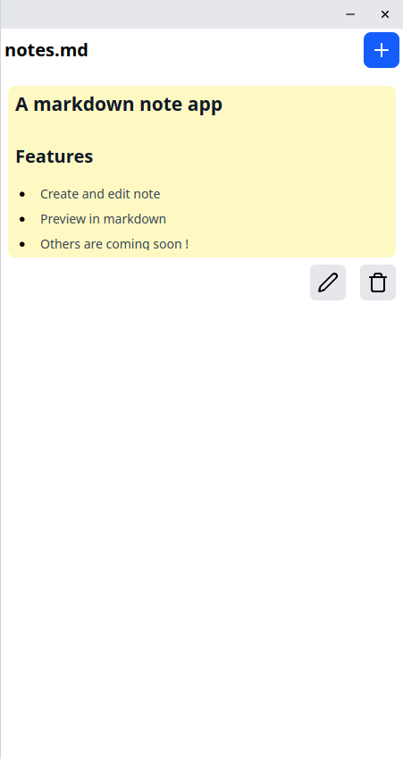

<p align="center">
  
</p>

<h1 align="center">notes.md</h1>

<p align="center">
  A lightweight desktop application for writing and previewing Markdown notes.
</p>

<p align="center">
  <a href="https://github.com/doucaml/notes.md/releases/latest">Latest release</a>
  ·
  <a href="https://github.com/doucaml/notes.md/issues">Report an issue</a>
</p>

## Features

- Markdown editor with preview
- GitHub-flavored Markdown rendering
- Simple desktop experience

## Screenshots

<p align="center">
  
  
  
</p>

## Installation

Download the latest version from the [GitHub Releases page](https://github.com/doucaml/notes.md/releases/latest).

Choose the package matching your operating system:

- **macOS:** `.dmg`
- **Windows:** `.msi` or `.exe`
- **Linux:** `.AppImage`, `.deb` or `.rpm`

### Linux AppImage

Make the AppImage executable before launching it:

```bash
chmod +x notes.md_*.AppImage
./notes.md_*.AppImage
```

Package-manager installations through Homebrew, Snap and Flatpak will be documented here as they become available.

## Updating

For a direct installation from GitHub, download and install the latest version from the [Releases page](https://github.com/doucaml/notes.md/releases/latest).

Automatic in-app updates are not currently enabled for direct downloads.

When package-manager distributions are available, use their standard update commands:

```bash
brew upgrade --cask notes-md
snap refresh notes-md
flatpak update
```

## Development

### Prerequisites

- [Node.js](https://nodejs.org/) (with npm)
- [Rust](https://www.rust-lang.org/)
- The system dependencies required by [Tauri](https://tauri.app/start/prerequisites/)

### Setup

Clone the repository and install the dependencies:

```bash
git clone https://github.com/doucaml/notes.md.git
cd notes.md
npm install
```

### Run in development mode

```bash
npm run tauri dev
```

### Build the application

```bash
npm run tauri build
```

The project is built with React, TypeScript, Vite, Tailwind CSS and Tauri 2.

## License

This project is released under the MIT License. See [LICENSE](LICENSE) for details.
